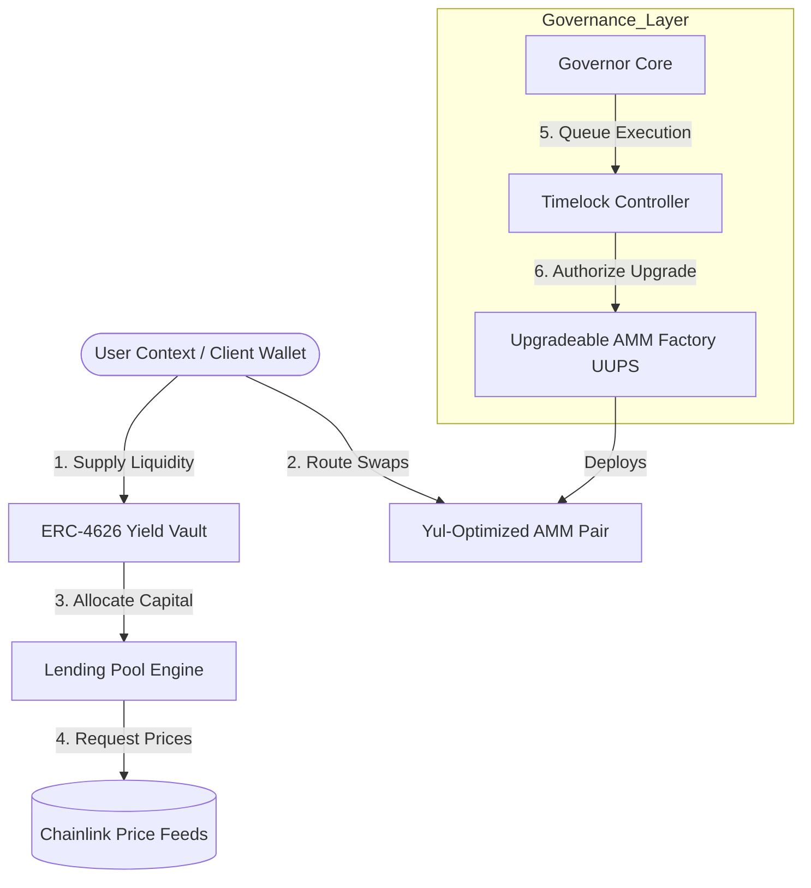

# Architecture & Design Document — DeFi Super-App

**Project:** BlockChain2Final Capstone  
**Date:** May 2026  
**Version:** 1.0  

## 1. Executive Summary
The DeFi Super-App Protocol is a vertically integrated financial ecosystem deployed on Layer 2 infrastructure. It synthesizes three core primitives: a gas-optimized Automated Market Maker (AMM), an over-collateralized Lending Engine, and an EIP-4626 compliant Yield Vault. The system is managed by a decentralized governance framework to ensure long-term sustainability and community-driven upgrades.

## 2. System Architecture

### 2.1 Design Philosophy
The protocol follows the "Legos" principle of DeFi, where each component is standalone yet provides deep liquidity and utility to the others. Security is enforced through invariant testing and static analysis, while efficiency is achieved through Yul assembly in core mathematical bottlenecks.

### 2.2 Component Interaction
The architecture is designed as a feedback loop:
1. **Users** deposit assets into the **Yield Vault**.
2. The Vault allocates capital into the **Lending Pool** to earn interest.
3. The **AMM** provides liquidity for swaps, allowing users to move between collateral types.
4. **Governance** (Governor + Timelock) controls parameters like LTV ratios and fee structures.

## 3. Core Components

### 3.1 AMM (Automated Market Maker)
The AMM implementation utilizes the Constant Product Formula ($x \cdot y = k$). 
* **Optimization:** Core math (like the Square Root) is written in Yul to minimize EVM stack overhead.
* **Efficiency:** Uses `CREATE2` for deterministic address generation, facilitating off-chain integration.

### 3.2 Lending & Risk Management
The lending engine allows users to supply collateral and borrow assets.
* **Health Factor:** Calculated as $(\sum \text{Collateral}_i \cdot LTV_i) / \text{Total Borrowed}$.
* **Liquidation:** Automated handlers trigger when a user's health factor drops below 1.0.

### 3.3 Yield Vault (ERC-4626)
The vault acts as a capital aggregator following the EIP-4626 standard. It automatically routes idle capital into the lending pool to maximize APR for depositors.

## 4. Governance Framework

### 4.1 The Governance Graph
The protocol uses a tri-partite governance system:
1. **GovernanceToken (DSA):** An ERC20Votes token that tracks voting power based on snapshots.
2. **DSATimelock:** A 2-day delay mechanism that prevents "governance attacks" by giving users time to exit if a malicious proposal is passed.
3. **DSAGovernor:** The logic engine handling quorum (4%), voting delay (1 day), and voting period (1 week).

### 4.2 Upgradeability
The protocol employs the UUPS (Universal Upgradeable Proxy Standard) pattern. This moves the upgrade logic into the implementation contract, saving gas on standard transactions compared to Transparent Proxies.

## 5. Security & Quality Assurance

### 5.1 CI/CD Pipeline
The project utilizes GitHub Actions to enforce strict quality gates:
* **Linting:** Solhint enforces naming conventions and security best practices.
* **Formatting:** `forge fmt` ensures a unified codebase.
* **Security Scanning:** Slither runs on every push to detect reentrancy and shadowing.

### 5.2 Testing Strategy
* **Unit Testing:** Comprehensive coverage on core math and state transitions.
* **Fuzz Testing:** Using Foundry to test pool invariants across a wide range of input values.
* **Coverage Milestone:** A mandatory 50% minimum coverage gate is enforced in the CI pipeline.

## 6. Conclusion
The DeFi Super-App Protocol demonstrates a robust, scalable architecture that balances performance with decentralization. By combining high-performance Yul math with the safety of OpenZeppelin's governance standards, the protocol is positioned for secure and efficient operation on Layer 2 networks.